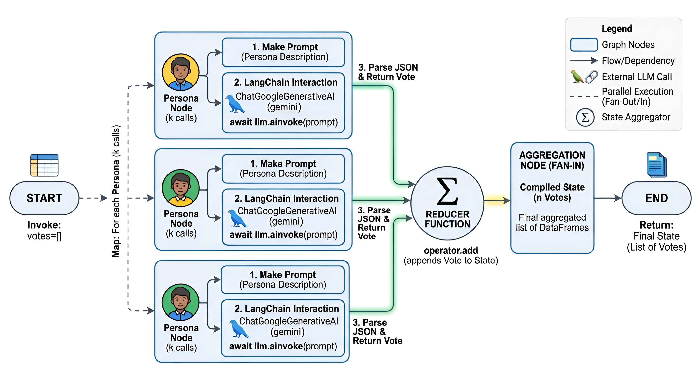

# Multi-Agent System Evaluation
Script for evaluation using a multi-agent system ([Li et al, 2024](https://doi.org/10.1007/s44336-024-00009-2)). It allows multiple personas to evaluate a set of items based on defined criteria, generating structured responses that include ratings, justifications, and rankings. This script requires a valid Google API key to run. Please create a `.env` file directly inside the repository folder and add the line `GOOGLE_API_KEY=your_actual_api_key` inside it.

Environment setup:

```bash
conda create -n myenv python=3.12
conda activate myenv
```

Dependencies installation:

```bash
pip install -r requirements.txt
```

Usage:

```bash
python multi_agent_evaluation.py
```

<p align="center">
    
</p>

### References

1. [Li, X., Wang, S., Zeng, S., Wu, Y., & Yang, Y. (2024). A survey on LLM-based multi-agent systems: workflow, infrastructure, and challenges. Vicinagearth, 1(1), 9.](https://doi.org/10.1007/s44336-024-00009-2)
